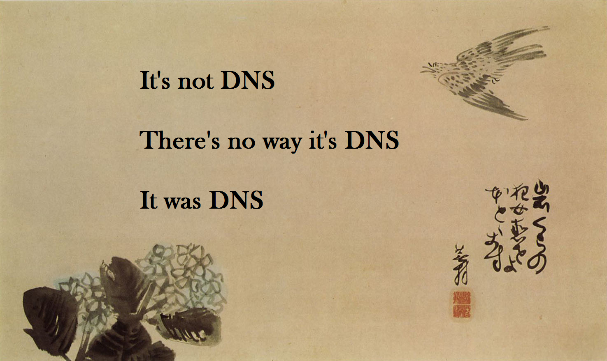
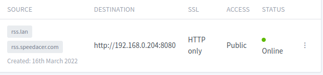
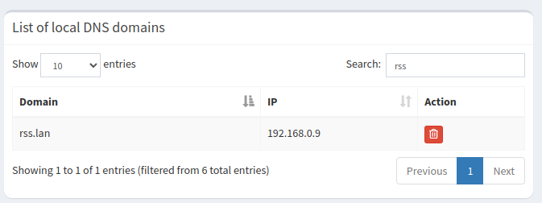
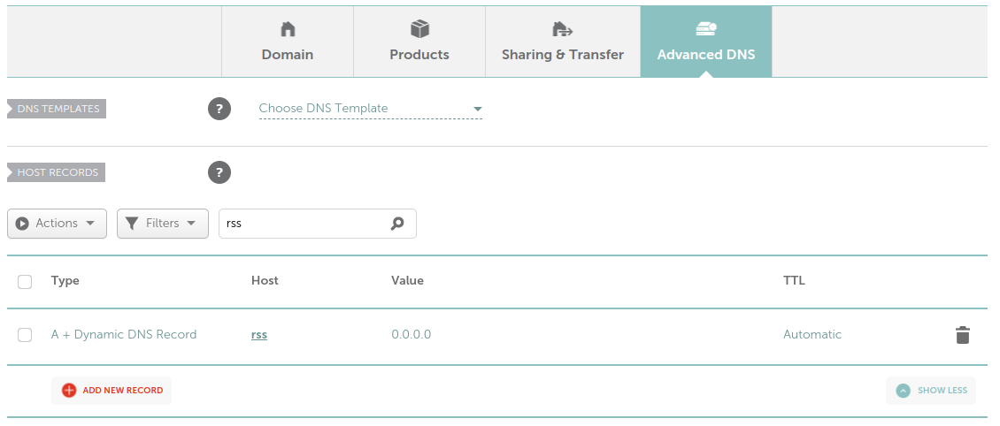

### How to stop typing ip addresses and ports and use real names in your homelab

> Note: Last night was the first time this all really clicked for me and I was able to consistently get a local domain name up and running inside my house, and add public access as I saw fit. It was a real lightbulb moment so I wanted to expand my quickly scribbled notes into something more permanent for Future Me and hopefully it'll help someone else out there who is struggling with DNS.

The domain needs to be added to the proxy server. In this case, Nginx Proxy Manager (NPM) running in Docker is taking care of the proxy setup. 

Once the proxy associates the domain to the ip:port, then we need a DNS server to handle the DNS routing and name lookup. Pihole with Unbound is serving that purpose and doing it well. It's very easy to get installed and setup. It's lightweight enough to run on a raspberry pi zero. I have an additional pihole running in proxmox for some redundancy so if either device is down, DNS will still work.

**How to setup a local domain**

I've chosen .lan for my homelab.

1. Add the domain to nginx proxy manager
2. Add the .lan name to the local DNS records of the pihole DNS server.
3. (optional) Add the fully qualified domain name (FQDN) if you want to later resolve it publicly.

**What if I want to use a real domain name I own?**

Same process. I can replace the NewProject.lan with NewProject.speedacer.com and it resolves internally.

**What if I want the domain to be publicly available?**

If I want the domain to resolve outside of my home, I login to namecheap, my domain registrar, and add the subdomain there. That's it.

Now I can access my RSS reader from home with rss.lan or remotely with rss.domain.tld.

I've also setup a VPN so I can access my homelab remotely without granting public access. But that's a story for another day.