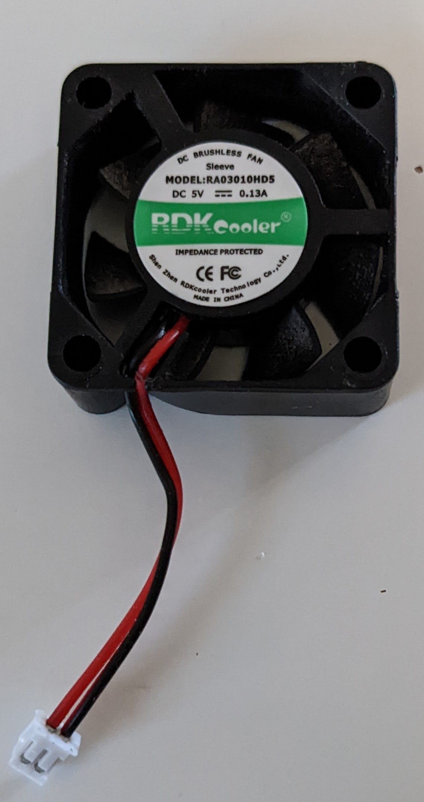

I really like the [Argon ONE M.2 Case for Raspberry Pi 4](https://www.argon40.com/products/argon-one-m-2-case-for-raspberry-pi-4?variant=39730210308161). One day last week I woke up to my little Rasberry Pi 4 NAS and Docker server offline. I went to investigate and found it powered off.

We had some storms roll through recently and I thought maybe it has lost power during the night. I powered it back on and *wwwhhhhiiirrrrzzzzzbbbuuuuuzzzzzz*.

Well, that's not ideal.

The only storage in the case is an NVMe drive so it's not storage since there's no moving parts. There is a case fan that is causing the noise. It sounds like the fan is dying. 

So I go about disassembling the case and pulled the fan out. It spun freely and there was no damage or issues upon visual inspection.

So I plugged it back into the case and powered it on and it made the same noise. I blew it out with canned air and set the case and fan back on the desk. 

Since the fan worked and sounded better when I plugged it back in, I reassembled the case. I hoped it would remain quiet and working since I was not able to find a replacement fan anywhere. Argon doesn't appear to sell one with the proper connector for the case. My efforts to find anything similar on Amazon or eBay were all unsuccessful.

In my searching for a new fan I found there is a script from Argon to control the fan speed.

I came across this repo, which is not offerd by Argon but is a hqppy customer. I'm thankful to have some across his repo since he not only links to the official script (hosted on Argon's servers) but also documents how to use it. Another thing I found missing from Argon's site and repo.

[okunze/Argon40-ArgonOne-Script: Script for the Argon ONE Pi 4 Raspberry Pi Case](https://github.com/okunze/Argon40-ArgonOne-Script)

> I have been using the [Argon ONE (V2) Case for Raspberry Pi 4](https://www.argon40.com/collections/raspberry-pi-cases) for a long time and I am very happy with it.
>
> To be able to use the case to the full extent, it is recommended to install the [script](https://download.argon40.com/argon1.sh) offered by Argon 40.
>
>I have saved a copy here along with the instructions to have a copy in case Argon 40 no longer offers it themselves.
>
>Just to clarify: I am in no way affiliated with Argon 40, I only use their cases as an end user.

The [official Argon repo](https://github.com/Argon40Tech/Argon40case/blob/2faf0f1da26f22396c945e2a37549d9ed396b852/README.md#official-installers) has links to the installers if you're prefer to fo straight to the source. The code for the [script](https://download.argon40.com/argon1.sh) itself does not appear to be in the repo however, not that I looked very hard.

I've owned this case for 8 months and had no idea this script existed. They do mention a "proprietary script" on the page for the case without storage.

> The case is still a heatsink and cools the Raspberry Pi with its fan (especially with its propietary script) but the fan is much more quiet than before to keep the Pi cool without causing any noise in the background. - [Argon ONE V2 Case for Raspberry Pi 4 – argon40](https://www.argon40.com/products/argon-one-v2-case-for-raspberry-pi-4?_pos=3&_sid=4e26cefff&_ss=r)

But they don't link to it from that page. Nor do they even mention there is a script on the [version with storage](https://www.argon40.com/products/argon-one-m-2-case-for-raspberry-pi-4) which I would think is more important since there's more heat generated.

Now that I know the script exists and installed it, the fan hasn't spun up once that I've heard. And it made a quiet *whiiirrrr* before when it was running. 

I suspect the fan was running constantly, even though it wasn't needed. I don't know if that's what caused the fan's issues or not. But learning of the script's existence has resolved the issue for now.

I did email Argon 40 support asking about a fan replacement and got a reply asking for more details so we'll see where this goes. At least for now I have my smallest "server" back online happily chugging away on a shelf.